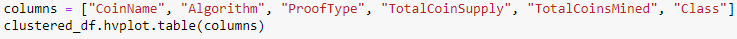

# Cryptocurrencies

# Overview

The purpose of this project is to analyze cryptocurrency data using Unsupervised Machine Learning. The original cryptocurrency data from CryptoCompare is preprocessed using Pandas to fit Unsupervised Machine Learning models. A clustering algorithm is used to group data and hvPlot visualization are used to share results.

# Software

•	Python 3.7

•	scikit-learn 0.24

•	hvPlot 0.7.0

•	Plotly 4.14.3

# Results

From the elbow curve above, it can be determined that the optimal number of clusters is 4 (k=4). This information is used for specifying the number of clusters (n_clusters) when initializing the K-means model:

**3D Plot**

This 3D scatter plot with cluster is generated using the following code:

**hvTable**

The hvTable above displays all of the currently tradeable cryptocurrencies. This table is created using the hvplot.table() function.

